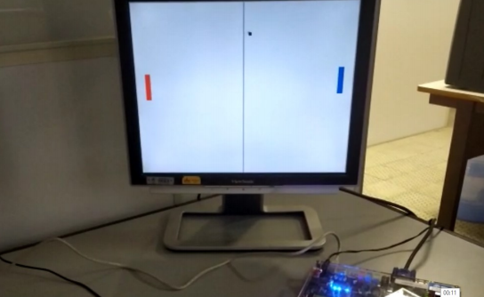

# pongproject
VHDL implementation of dual-player "Pong" game in Altera DE2 Board, using VGA.

Resolution: 640x480 px

# File hierarchy:
pongGame.vhd ---> Top level entity

pongSync.vhd ---> Generates horizontal and vertical synchronism pulses based on 25 MHz pixel counts

pongImg.vhd ---> Generates image (paddles, ball, background, peripheric lines), given due x and y counts
    
    
